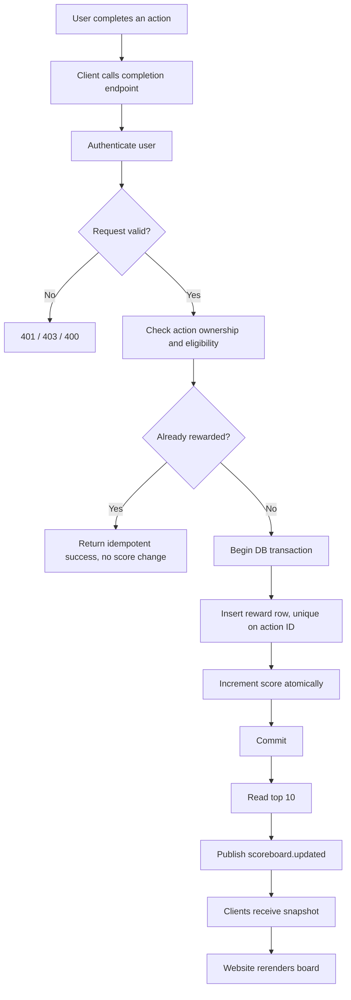

# Problem 6 — Live Scoreboard API Specification

A specification for the scoreboard module of the application server, written for the backend team that will implement it. It covers three things: how score updates arrive and get validated, how scores are stored safely under concurrency, and how the website receives live top-10 updates.

The score update endpoint treats every request as hostile until proven otherwise. A client must never be able to name an arbitrary score increase, and must never be able to touch another user's score.

## Responsibilities

The module splits into four parts:

1. **Score API** — accepts a reward request after a user action completes.
2. **Validation** — confirms the caller is authenticated, owns the action, and hasn't already been rewarded for it.
3. **Score store** — holds current scores. Updates go through a single transaction so concurrent completions stay correct.
4. **Realtime publisher** — pushes the latest top 10 to connected clients over SSE or WebSocket.

PostgreSQL (or any relational database) is the source of truth. The update needs transactions, unique constraints, and row-level locking, which is exactly what relational databases are for. Redis earns its place later — caching, pub/sub fan-out, rate-limit counters, connection tracking — but it shouldn't become the only place scores live unless something forces that.

Out of scope: what the user action actually is. This module only needs proof that an action happened, from a source it can trust.

## Execution flow



One boundary matters more than anything else in the diagram:

> The client names the action. The server decides the points.

So the request body carries an `actionId`, nothing else:

```json
{ "actionId": "action_01J..." }
```

If the client could send `score += 100` and have the server believe it, none of the rest of this document would matter. Where the action system is a separate service, prefer verifying a signed server-to-server completion event over trusting whatever the browser claims.

## API

### Submit an action completion

`POST /api/v1/actions/{actionId}/complete`

Authentication required. The user comes from the access token, not the body:

```http
POST /api/v1/actions/action_123/complete
Authorization: Bearer <access-token>
Content-Type: application/json
```

First time through, the action is valid and unrewarded:

```json
{
  "actionId": "action_123",
  "rewarded": true,
  "pointsAwarded": 10,
  "score": 1250
}
```

Same request again — a retry after a timeout, say — returns success without awarding anything twice:

```json
{
  "actionId": "action_123",
  "rewarded": false,
  "pointsAwarded": 0,
  "score": 1250
}
```

Returning 200 on duplicates rather than 409 keeps client retry logic trivial. Either works; just decide deliberately (see error table).

### Current scoreboard

`GET /api/v1/scoreboard?limit=10`

```json
{
  "items": [
    { "rank": 1, "userId": "user_123", "displayName": "Alice", "score": 1540 },
    { "rank": 2, "userId": "user_456", "displayName": "Bob",   "score": 1490 }
  ],
  "updatedAt": "2026-08-23T14:00:00Z"
}
```

This endpoint isn't optional even with realtime push in place. It's what a browser loads on first paint, and what it falls back to whenever the stream drops.

### Realtime stream

`GET /api/v1/scoreboard/stream`

Server-sent events unless there's already WebSocket infrastructure worth reusing. The scoreboard is one-directional — server to client — and SSE reconnects automatically with less code. WebSocket makes sense once bidirectional features appear.

```text
event: scoreboard.updated
data: {"items":[{"rank":1,"userId":"user_123","displayName":"Alice","score":1540}],"updatedAt":"2026-08-23T14:00:00Z"}
```

Whatever the transport, recovery is always: reconnect, then fetch the full snapshot from `GET /api/v1/scoreboard`.

## Data model

```text
users                          -- existing table, add one column
-------------
id                  PK
score               bigint NOT NULL DEFAULT 0


score_rewards                  -- audit trail + idempotency mechanism
-------------
id                  PK
user_id             FK -> users.id
action_id           NOT NULL
points              bigint NOT NULL
awarded_at          timestamp NOT NULL
metadata            jsonb NULL
```

The uniqueness constraint depends on what an action ID means in the product:

```sql
UNIQUE (action_id)              -- one reward per action, globally
UNIQUE (user_id, action_id)     -- same action ID may recur per user
```

Pick one to match the action system's semantics; don't leave it to whichever insert wins the race.

Keeping `score_rewards` around costs one insert per reward and buys two things: replay detection (the idempotency check reads from it) and an investigation trail when someone reports suspicious scores. A bare counter column can't answer "how did this user get 50,000 points".

## The update transaction

Both writes happen together or neither happens:

```sql
BEGIN;

INSERT INTO score_rewards (user_id, action_id, points, awarded_at)
VALUES (:userId, :actionId, :points, NOW())
ON CONFLICT (user_id, action_id) DO NOTHING;
-- rows inserted = 0 means already rewarded; skip the increment

UPDATE users
SET score = score + :points
WHERE id = :userId;

COMMIT;
```

The implementation must make the skip-explicit: increment only when the insert created a row. What must *not* happen is the naive sequence —

```text
check reward exists -> update score -> create reward
```

— because two concurrent requests both pass the check before either inserts, and the score climbs twice off one action. The unique constraint inside the transaction is the whole defence; the application-level check is just a fast path.

For the same reason, never read the score into memory, add, and write back. `SET score = score + :points` lets the database serialise the arithmetic.

## Authorisation and anti-cheat

The core rule of the module:

> The client can ask for a reward. Only the server decides whether one exists and what it's worth.

Concretely:

1. **Authenticate every score-changing request.** Derive the user from session or token. A `userId` field in the request body is a suggestion from a stranger, nothing more.
2. **Never accept a score delta.** An API shaped like `{ "userId": "...", "points": 1000000 }` is an open faucet. Points come from server-side config keyed by action type.
3. **Make rewards idempotent.** Every completion carries a unique action/event ID; retries after timeouts must be free.
4. **Check ownership.** If `action_456.user_id != authenticated_user_id`, reject with 403. Without this, a user replays someone else's action IDs for free points.
5. **Prefer a trusted completion record.** The strongest available design has the system that observed the action emit a completion event the scoring service verifies. When the browser is the only witness, the backend cannot fully prove the action happened — client-side checks raise the cost of cheating, they don't close the hole. Say so plainly in the design doc rather than pretending otherwise.
6. **Rate limit the endpoint.** Not a substitute for any of the above; it blunts abuse volume. Something like 30 req/min per user and 120 req/min per IP is a sane starting point, tuned to real action frequency later.
7. **Watch for abuse patterns.** Log (without credentials): abnormal completion frequency, repeated rejections, cross-user action attempts, invalid/expired action IDs, outsized score jumps over short windows.

None of these controls is individually clever. Together, applied at the layer that touches money-equivalent data, they're the difference between a leaderboard and a random number generator.

## Live update flow

After a committed score change:

1. Read the new top 10.
2. Publish a `scoreboard.updated` event carrying the full snapshot.
3. Connected clients replace their local copy wholesale.

Sending the whole top 10 instead of a diff looks wasteful and isn't. Clients stay dumb — no ranking logic in the browser, no ordering bugs — and a dropped event self-heals on the next snapshot.

What triggers a broadcast? Simplest correct answer: every successful score change publishes, and the consumer rebroadcasts the current top 10 whether or not membership moved. That produces extra traffic when rank 200 completes an action nobody sees. Optimise later — publish only when the visible ten changed, or batch publications into short windows — if traffic ever makes it worth it.

## Reference implementation

Framework-agnostic shape; repositories and framework choices belong to the team:

```ts
async function completeAction(request, authUser) {
  const actionId = request.params.actionId;
  const userId = authUser.id;

  const action = await actionRepository.findById(actionId);
  if (!action) throw new NotFoundError('Action not found');
  if (action.userId !== userId) throw new ForbiddenError('Action does not belong to user');
  if (!action.isCompletable) throw new BadRequestError('Action cannot be completed');

  const points = rewardPolicy.getPoints(action.type);

  const result = await db.transaction(async (tx) => {
    const reward = await tx.scoreRewards.insertIfNotExists({ userId, actionId, points });

    if (!reward.created) {
      return { rewarded: false, pointsAwarded: 0, score: await tx.users.getScore(userId) };
    }

    const user = await tx.users.incrementScore(userId, points);
    return { rewarded: true, pointsAwarded: points, score: user.score };
  });

  if (result.rewarded) {
    const top10 = await scoreboardRepository.getTop10();
    await realtimePublisher.publish('scoreboard.updated', {
      items: top10,
      updatedAt: new Date().toISOString(),
    });
  }

  return result;
}
```

Note the publish sits outside the transaction. A slow or dead pub/sub connection must not hold a score write hostage.

## Failure handling

**Score committed, publish failed.** The score stands. Never roll back a valid reward because a notification didn't go out. The cost is a possibly-stale board until the next event, page load, or reconnect — acceptable for a first version. When stale boards become unacceptable, move to the outbox pattern:

```text
DB transaction: update score + insert outbox event (atomic)
background worker: read outbox -> publish -> mark processed
```

That guarantees eventual delivery at the price of a worker to operate.

**Client disconnects.** Correctness doesn't depend on the connection. On reconnect: fetch `GET /api/v1/scoreboard`, then reopen the stream. Order between those two steps varies by transport; ending with a fresh snapshot is the invariant.

## Ranking

Deterministic ordering, always:

1. `score DESC`
2. tie-break on `scoreUpdatedAt ASC`, or another stable column

Two users at 1,000 points must render in the same order on every client, every refresh. Which tie-break wins is a product decision — make it before implementation, not during a bug hunt.

## Error responses

Consistent envelope:

```json
{
  "error": { "code": "ACTION_NOT_FOUND", "message": "Action not found" }
}
```

| HTTP | Code | Meaning |
|---|---|---|
| 400 | `INVALID_ACTION` | Action cannot be completed |
| 401 | `UNAUTHENTICATED` | Missing or invalid authentication |
| 403 | `ACTION_FORBIDDEN` | Action belongs to another user |
| 404 | `ACTION_NOT_FOUND` | Action does not exist |
| 409 | `ACTION_ALREADY_COMPLETED` | Optional explicit duplicate response |
| 429 | `RATE_LIMITED` | Too many requests |
| 500 | `INTERNAL_ERROR` | Unexpected failure |

Duplicate handling again: 200-with-`rewarded:false` beats 409 for retry-heavy clients. Choose once, document it in the OpenAPI spec.

## Testing

Unit tests, minimum set:

- authenticated user gets the expected reward
- unauthenticated requests rejected
- another user's action rejected
- unknown action rejected
- points come from server-side policy, never the request
- duplicate completion awards nothing
- malformed reward configuration fails safe

Integration tests:

- reward insert and score increment commit in one transaction
- N concurrent duplicate requests → exactly one award
- N concurrent distinct actions → sum of awards, nothing lost
- top 10 ordering matches the ranking rules
- successful update publishes an event; failed publish leaves the score intact

Security tests — try to cheat, expect failure every time:

- tampered `userId`, tampered points value
- replayed old completion
- another user's action ID
- request floods past the rate limiter
- forged or malformed action IDs

If any of those produce a score increase, ship nothing.

## Observability

Metrics worth having from day one:

```text
score_update_requests_total
score_update_success_total
score_update_rejected_total
score_reward_duplicate_total
score_update_latency_ms
scoreboard_broadcast_total
scoreboard_broadcast_failures_total
active_scoreboard_connections
```

Structured logs carry `requestId`, `userId`, `actionId`, `pointsAwarded`, `result`, `latencyMs`. Tokens and credentials never enter logs.

## Non-goals

- Deciding what the user action is, or whether it was fun.
- Trusting client-submitted scores, in any form.
- Storing the scoreboard in browser memory and calling it live.
- Proving an action happened when no trusted server-side witness exists — no architecture fixes that from the scoring side alone.

## Implementation checklist

- [ ] Agree with the platform team where action-completion truth comes from
- [ ] Decide global vs per-user action uniqueness
- [ ] Define the reward policy table (server-side)
- [ ] Add the idempotency constraint
- [ ] Build the authenticated completion endpoint with atomic updates
- [ ] Build `GET /api/v1/scoreboard` with deterministic ranking
- [ ] Stand up SSE/WebSocket broadcast
- [ ] Add rate limiting, audit logging, metrics
- [ ] Write unit, integration, concurrency, and security tests
- [ ] Frontend: initial fetch + stream subscribe + reconnect fallback
- [ ] Revisit outbox pattern when delivery guarantees matter

## Open design questions

Flagged now so they don't surface as production incidents later:

**Where does completion truth come from?** The biggest gap in the brief. If the browser's word is the only evidence, cheating is cheap no matter what the API validates. Push for the action-producing service to emit verifiable completion events early.

**How often can one action pay out?** Once forever? Daily? Per round? Unlimited with rate limiting? Whatever the answer, enforce it server-side — the client's opinion is irrelevant here.

**SSE or WebSocket?** Default SSE for one-way updates; revisit only if bidirectional realtime lands anyway.

**Is post-commit publishing good enough?** For launch, probably yes — a missed event self-heals via page load or refetch. Switch to the outbox pattern when "eventually correct within seconds" stops being acceptable.

**When does Redis enter the picture?** Not at the start. Postgres handles the read volume of a top-10 query fine until measurements say otherwise. Sorted sets become attractive around the point where scoreboard reads show up in latency dashboards.

**When do scoring and streaming split into separate services?** At thousands of concurrent connections, dedicated realtime workers consuming from Redis Streams/Kafka beat one process doing HTTP plus fan-out. Premature today; worth naming the threshold now so scaling isn't improvised.
